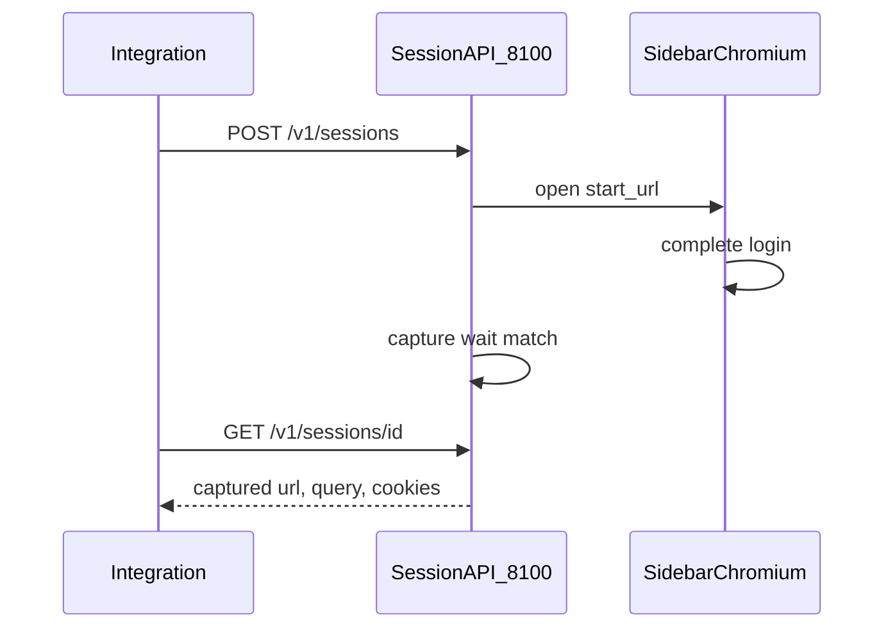

# Browser Companion

[](https://github.com/Przemko92/homeassistant-browser-companion/actions/workflows/ci.yml)
[](https://pypi.org/project/ha-browser-companion/)
[](LICENSE)
[](browser_companion/config.yaml)
[](https://buymeacoffee.com/przemko92)

A Home Assistant add-on that embeds **Chromium in the sidebar**. Your integration opens a login URL; the **user** completes the page (forms, captcha, 2FA); the add-on captures the matching redirect, navigation, or custom-scheme URL and returns it over HTTP.

It does **not** solve captchas or fill forms. The human stays in the loop.

Custom components should integrate with [**ha-browser-companion**](https://pypi.org/project/ha-browser-companion/) (source in [`python/`](python/)), not by copying HTTP helpers. That package discovers the add-on, drives a login session, and ships a config-flow mixin.

## Requirements

- Home Assistant OS or Supervised. It does **not** run on HA Container / Core (no Supervisor, no add-ons).
- About **1 GB RAM** for Chromium.

## Install

1. Settings → Add-ons → Add-on Store → ⋮ → **Repositories**
2. Add `https://github.com/Przemko92/homeassistant-browser-companion`
3. Install **Browser Companion** and start it
4. Chromium appears in the sidebar (admin users)

After an update: Add-ons → Browser Companion → **Rebuild** (or uninstall and install again). Startup logs should show `loading service 'companion'` and the session API listening on port **8100**.

## How it works

| Port | Role |
| --- | --- |
| **5800** | Chromium web UI. Home Assistant Ingress (sidebar) uses this. |
| **8100** | Session API for custom components. Keep it **unpublished** on the host. |

Only **one session** at a time. Login runs in an **incognito** profile. After a match, Chromium shows a success overlay. **Close** wipes the tab; **Keep open** only hides the overlay. A new `POST /v1/sessions` replaces the previous session.



Integrations **declare** what to wait for. The add-on does not guess.

## Integrate with `ha-browser-companion`

The PyPI package [`ha-browser-companion`](https://pypi.org/project/ha-browser-companion/) lives in [`python/`](python/) in this repository. Use it from a custom component instead of talking to port 8100 by hand.

```bash
pip install ha-browser-companion
```

In `manifest.json`:

```json
{
  "requirements": ["ha-browser-companion>=0.1.1"]
}
```

Depends on `aiohttp` (already in Home Assistant). Home Assistant itself is **not** a package dependency: discovery and the config-flow mixin import it only when those helpers run.

Full package docs, translation keys, and publishing notes: [`python/README.md`](python/README.md). Copy-paste config flow: [`python/examples/config_flow.py`](python/examples/config_flow.py).

### Config flow (recommended)

Subclass `CompanionLoginFlow` and implement `async_companion_start` / `async_companion_finish`. The mixin discovers the add-on, calls `POST /v1/sessions`, shows the progress step (link to the sidebar panel), polls until capture, retries on failure, and deletes the session.

```python
from homeassistant.config_entries import ConfigFlow, ConfigFlowResult
from ha_browser_companion import CompanionLoginFlow, CompanionStart, captured_query

from .const import DOMAIN, WAIT

class MyConfigFlow(CompanionLoginFlow, ConfigFlow, domain=DOMAIN):
    VERSION = 1
    companion_client_id = DOMAIN

    async def async_step_user(self, user_input=None) -> ConfigFlowResult:
        if not self.companion_supervisor_present():
            return self.async_abort(reason="companion_requires_supervisor")
        return await self.async_step_companion()

    async def async_companion_start(self) -> CompanionStart:
        return CompanionStart(
            start_url="https://example.com/login",
            wait=WAIT,  # same payload as POST /v1/sessions
        )

    async def async_companion_finish(self, captured: dict) -> ConfigFlowResult:
        code = captured_query(captured, "code")
        if not code:
            return await self.async_step_companion_failed()
        return self.async_create_entry(title="Example", data={"code": code})
```

Optional on `CompanionStart`: `navigate_after`, `success_message`. Optional `async_companion_on_close()` for extra cleanup (OAuth helper, PKCE state, …).

Cookie capture (Allegro-style):

```python
from ha_browser_companion import captured_cookie

cookie = captured_cookie(captured, "QXLSESSID")
```

The mixin expects translation keys `step.companion`, `step.companion_failed`, `progress.companion_wait`, and abort `companion_requires_supervisor`. Placeholders: `companion_url` and `companion_href` are the same sidebar panel URL (`/{slug}`). Copy the JSON from [`python/README.md`](python/README.md#translations).

### HTTP client only

If you already have a config flow and only need the session API:

```python
from ha_browser_companion import (
    CompanionError,
    async_create_session,
    async_delete_session,
    async_discover_companion,
    async_wait_captured,
)

found = await async_discover_companion(hass)
if not found:
    raise RuntimeError("Browser Companion add-on is not running")

created = await async_create_session(
    session,
    found.base_url,
    start_url=auth_url,
    wait={"event": "http_redirect", "location_prefixes": ["app://callback"]},
    client_id="my_integration",
)
captured = await async_wait_captured(session, found.base_url, created["id"])
code = captured["query"]["code"]
await async_delete_session(session, found.base_url, created["id"])
```

`async_discover_companion` lists Supervisor add-ons whose slug ends with `browser_companion`, then probes `GET /v1/health`. `async_wait_captured` polls about every 2 seconds until `captured`, or raises `CompanionError` (`expired`, `timeout`, `browser_unavailable`, …). `BrowserCompanionClient(session, base_url)` exposes the same methods.

Wait `event` values and JSON shapes are documented in [Session API](#session-api) below.

## Session API

Base URL:

```text
http://{addon-hostname}:8100
```

Hostname is the add-on slug with `_` replaced by `-`. The slug always ends with `browser_companion`.

| Install | Hostname examples |
| --- | --- |
| Local / this repo | `local-browser-companion` |
| Store (hashed) | `{hash}-browser-companion` |

The sidebar is **not** the API. Ingress talks to port 5800. Integrations must call port **8100** on the add-on hostname (Supervisor Docker network). There is no webhook: poll until the session is `captured`, `expired`, or `error`.

The API has **no authentication**. Leave port 8100 unpublished so only the internal network can reach it.

### `GET /v1/health`

Liveness and current session (if any).

```json
{ "ok": true, "session": null }
```

When a session exists, `session` is the same public object as `GET /v1/sessions/{id}`.

### `POST /v1/sessions`

Creates a session (HTTP **201**) and navigates Chromium to `start_url`. Replaces any previous session.

**Body**

| Field | Required | Type | Notes |
| --- | --- | --- | --- |
| `start_url` | yes | string | Non-empty URL Chromium opens |
| `wait` | yes | object or array | First matching rule wins |
| `client_id` | no | string | Caller label; default `unknown`; max 64 chars |
| `timeout_seconds` | no | int | Default `600`; clamped to **30–3600** |
| `success_message` | no | string | Overlay after capture; max 500 chars |
| `navigate_after` | no | object | `{ "url": "https://…", "cookies": ["NAME"] }` — both required if set. After those cookies appear, Chromium navigates to `url` before waiting for the navigation match. |

**201 response**

```json
{ "id": "3f2c…", "status": "pending", "client_id": "biedronka" }
```

#### Wait events

`wait` is one rule or a list of rules. The first match wins.

| `event` | When | Match fields | Optional |
| --- | --- | --- | --- |
| `http_redirect` | HTTP 3xx with a `Location` header | `location_prefixes` and/or `location_schemes` | `status_codes` (default `301, 302, 303, 307, 308`), `cookies` |
| `navigation` | Page **finished loading** on a matching URL (the request is not aborted; History API URL changes count) | `url_prefixes` / `prefixes` and/or `url_schemes` / `schemes` | `cookies` |
| `protocol_handler` | Chromium hands a custom scheme to the OS (`xdg-open`) | `schemes` and/or `url_prefixes` | `cookies` |

If `cookies` is set (list of cookie names), capture waits until those values are non-empty, then includes them in the result.

#### Examples

**HTTP 302 + custom-scheme Location** (Biedronka-style OAuth):

```json
{
  "client_id": "biedronka",
  "start_url": "https://konto.biedronka.pl/realms/loyalty/protocol/openid-connect/auth?…",
  "wait": {
    "event": "http_redirect",
    "status_codes": [302],
    "location_prefixes": ["app://cma20.biedronka.pl"]
  },
  "timeout_seconds": 600
}
```

**Navigation + cookies** (Allegro-style):

```json
{
  "client_id": "allegro",
  "start_url": "https://allegro.pl",
  "wait": {
    "event": "navigation",
    "url_prefixes": [
      "https://allegro.pl/moje-allegro/zakupy/kupione",
      "https://www.allegro.pl/moje-allegro/zakupy/kupione"
    ],
    "cookies": ["QXLSESSID"]
  },
  "timeout_seconds": 600
}
```

**Custom protocol handler:**

```json
{
  "client_id": "myapp",
  "start_url": "https://example.com/login",
  "wait": { "event": "protocol_handler", "schemes": ["myapp"] }
}
```

**Several rules** (first match wins):

```json
{
  "start_url": "https://example.com/login",
  "wait": [
    { "event": "http_redirect", "location_prefixes": ["app://callback"] },
    { "event": "navigation", "url_prefixes": ["https://example.com/done"] }
  ]
}
```

**`navigate_after`** (cookies appear, then go to a post-login URL):

```json
{
  "client_id": "allegro",
  "start_url": "https://allegro.pl",
  "wait": {
    "event": "navigation",
    "url_prefixes": ["https://allegro.pl/moje-allegro/zakupy/kupione"],
    "cookies": ["QXLSESSID"]
  },
  "navigate_after": {
    "url": "https://allegro.pl/moje-allegro/zakupy/kupione",
    "cookies": ["QXLSESSID"]
  },
  "success_message": "Signed in. Click OK to close."
}
```

### `GET /v1/sessions/{id}`

| Status | Meaning |
| --- | --- |
| `pending` | User is still in Chromium |
| `captured` | A wait rule matched |
| `expired` | `timeout_seconds` elapsed |
| `error` | Browser/CDP failed (`error` field, e.g. `browser_unavailable`) |

**404** `{ "error": "not_found" }` if the id is unknown or was replaced.

**Captured payload**

```json
{
  "id": "3f2c…",
  "status": "captured",
  "client_id": "biedronka",
  "url": "app://cma20.biedronka.pl?code=…",
  "query": { "code": "…" },
  "event": "http_redirect",
  "status_code": 302
}
```

- `query` is flattened from the query string; if empty, the URL fragment (`#…`) is parsed instead.
- `status_code` is present for `http_redirect`.
- `cookies` is present only when `wait.cookies` was set and values were found.

### `DELETE /v1/sessions/{id}`

Cancels the session and stops CDP.

```json
{ "ok": true }
```

**404** `{ "error": "not_found" }`.

### Error codes (`POST /v1/sessions`)

| HTTP | `error` |
| --- | --- |
| 400 | `invalid_json` |
| 400 | `start_url_required` |
| 400 | `wait_required`, `wait_invalid`, `wait_event_unknown` |
| 400 | `wait_status_codes_invalid`, `wait_location_required`, `wait_url_required`, `wait_scheme_required` |
| 400 | `navigate_after_invalid` |

## Local development

**Unit tests** (no Chromium):

```bash
pip install -r requirements-dev.txt
pytest -q
```

Python client (directory [`python/`](python/), separate from the add-on):

```bash
cd python
pip install -e ".[dev]"
pytest -q
```

**Add-on without Supervisor** — Chromium on http://localhost:5800, API on http://localhost:8100:

```bash
docker compose up --build
curl -s http://localhost:8100/v1/health
```

**Full Supervisor + Ingress** — official `ghcr.io/home-assistant/devcontainer:6-apps` image (~8 GB RAM, privileged). See [`.devcontainer/README.md`](.devcontainer/README.md).

## Support

If this add-on is useful to you, you can [buy me a coffee](https://buymeacoffee.com/przemko92).

## License

[MIT](LICENSE). Not affiliated with Google or Home Assistant.
